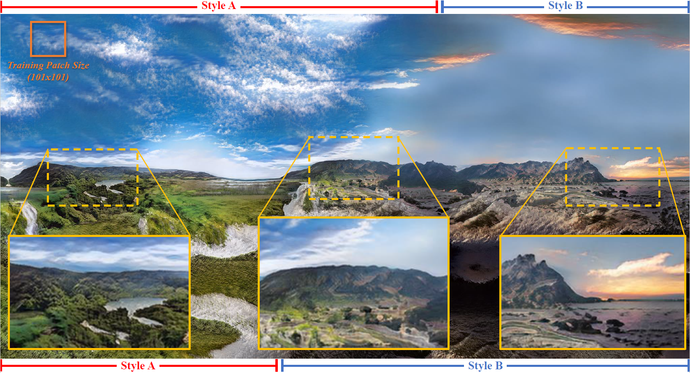
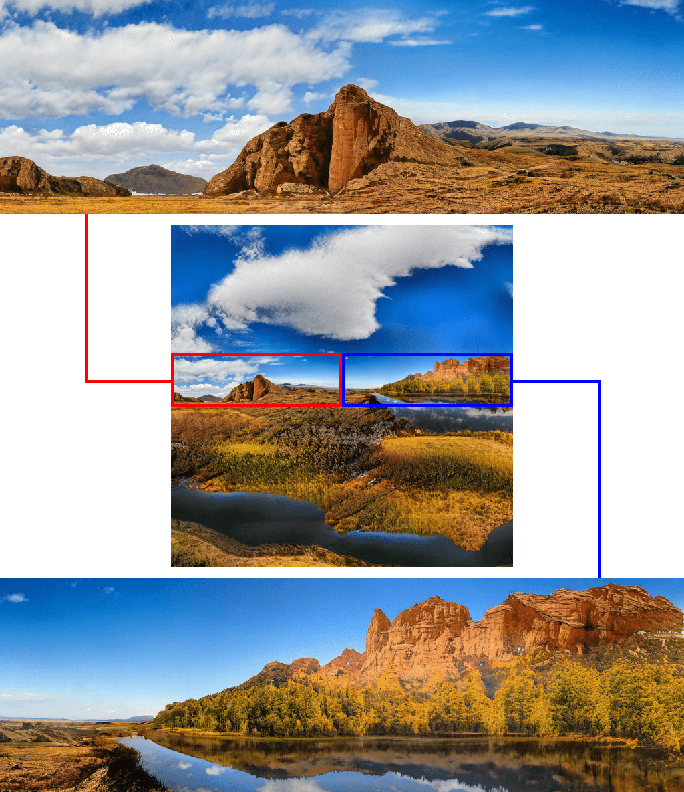
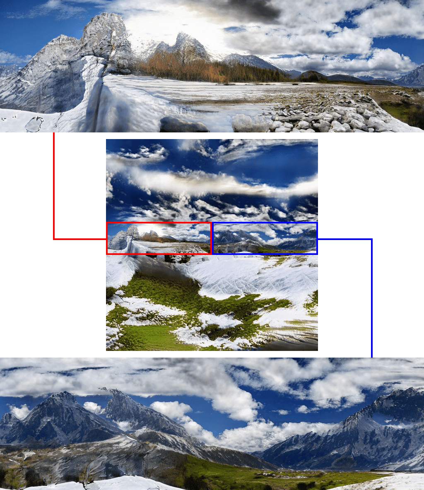

# InfinityGAN: Towards Infinite-Resolution Image Synthesis

> *"To infinity and beyond!"*

**Chieh Hubert Lin<sup>1</sup>, Hsin-Ying Lee<sup>2</sup>, Yen-Chi Cheng<sup>3</sup>, Sergey Tulyakov<sup>2</sup>, Ming-Hsuan Yang<sup>1,4</sup>** <br>
<sup>1</sup>UC Merced, <sup>2</sup>Snap Research, <sup>3</sup>CMU, <sup>4</sup>Google Research

<details>
    <summary>Abstract (click to view)</summary>
    We present a novel framework, InfinityGAN, for arbitrary-sized image generation. The task is associated with several key challenges. First, scaling existing models to an arbitrarily large image size is resource-constrained, in terms of both computation and availability of large-field-of-view training data. InfinityGAN trains and infers in a seamless patch-by-patch manner with low computational resources. Second, large images should be locally and globally consistent, avoid repetitive patterns, and look realistic. To address these, InfinityGAN disentangles global appearances, local structures, and textures. With this formulation, we can generate images with spatial size and level of details not attainable before. Experimental evaluation validates that InfinityGAN generates images with superior realism compared to baselines and features parallelizable inference. Finally, we show several applications unlocked by our approach, such as spatial style fusion, multi-modal outpainting, and image inbetweening. All applications can be operated with arbitrary input and output sizes.
</details>

**[[Project Page]](https://bit.ly/InfinityGANProject) [[Paper]](https://bit.ly/InfinityGANPaper) [[Supplementary]](http://bit.ly/InfinityGANSupp)**



<div>
    
    
</div>
(*These samples are downsampled, please access the raw images via [Google Drive](https://drive.google.com/drive/folders/1Ej3dgWVagitJR7FYtrlEWu3DSC2cOvJi?usp=sharing))

---

## How To Use
- [A. Configure Environment](#a-configure-environment)
- [B. Prepare Data](#b-prepare-data)
- [C. Train Model](#c-train-model)
- [D. Test Model](#d-test-model)
- [E. Interactive Generation](#e-interactive-generation)
- [F. Evaluation](#f-evaluation)
- [G. Pretrained Models And Additional Materials](#g-pretrained-models-and-additional-materials)

---

### A. Configure Environment
Our repository works on Ubuntu. (One of our machine setups: `Ubuntu + Python 3.8.5 + cudatoolkit 10.2`)

**Setup**:
1. Create conda environement with `conda env create --name pt16 --file meta_data/environment.yml`. We only tested our pipeline on PyTorch 1.6. Please avoid using PyTorch 1.7 and 1.8 as we observe an awkward degradation in performance.
2. (Alternative) Directly install with `conda install pytorch==1.6.0 torchvision==0.7.0 cudatoolkit=10.2 -c pytorch`, `conda install python-lmdb tqdm matplotlib imageio scikit-image scikit-learn scipy=1.5` and `pip install tensorboardx==2.1 pyyaml==5.4.1 easydict`.
3. Designate a directory where you are going to place all your lmdb dataset in `env_config.py`.

P.S. Theoretically this repository should be workable on Windows if you manage to run [StyleGAN2](https://github.com/NVlabs/stylegan2), which requires extra efforts in dealing with cuda codes building with Visual Studio.

---

### B. Prepare Data

**Notes:**
We originally use "Flickr-Landscape (small)" in the V1 paper on Arxiv. We then update the results of all models to "Flickr-Landscape (large)" in the later versions of the paper. We only use the training split for all training and FID evaluation. Nevertheless, we still provide a validation set in "Flickr-Landscape (large)". Notice that the Flickr-Landscape dataset contains images at different sizes without aligning them in the lmdb, so you may add customized training augmentations if desired.

- Use prepared lmdb:

| Dataset                  | Used in latest paper | # images | Minimum image size | All images same shape? | Size | Has holdout set? | Link         |
| :---                     | :---:                | ---:     | ---:            | :---:                  | ---: | :---:            | :--- |
| Flickr-Landscape (small) | X                    |   50,000 |            1024 | X                      |  89G | X                | [(Google Drive)](https://drive.google.com/drive/folders/1gwO8i_2ZsF84ORbWNtcixC-_BXbdL1Zh?usp=sharing) |
| Flickr-Landscape (large) | V                    |  400,000 |            1024 | X                      | 786G | V                | [(Google Drive)](https://drive.google.com/drive/folders/1tuDyjGWy_GvioyJIDR8H7j0_BytKwWhF?usp=sharing) |
| Flickr-Scenery           | V                    |   54,710 |             256 | V                      | 3.5G | V                | [(Will release via In&Out)](https://github.com/yccyenchicheng/InOut) |
| Places2-Scenery-Subset   | V                    |   56,431 |             256 | V                      | 3.2G | V                | [(Will release via In&Out)](https://github.com/yccyenchicheng/InOut) |

- **Construct your custom dataset**
    1. Prepare a config similar to `configs/dataset/flickr-landscape-small.yaml`.
    2. Run (we only use training set)
        ```
        python prepare_data.py ./configs/dataset/flickr-landscape-small.yaml --train_only
        ```
    3. The lmdb will be constructed at the `LMDB_ROOTS` you specified in `env_config.py`.
    4. Remember to modify the `data_params.dataset` flag in your training config when you train the model.

---

### C. Train Model
Our pipeline requires specifying `CUDA_VISIBLE_DEVICES`, and automatically switch to dataparallel if two or more GPUs are specified.

- InfinityGAN: <br>
    ```
    CUDA_VISIBLE_DEVICES="0" python train.py ./configs/model/InfinityGAN.yaml
    ```
- StyleGAN2 + NCI: <br>
    ```
    CUDA_VISIBLE_DEVICES="0" python train.py ./configs/model/StyleGAN2_NCI.yaml
    ```
- StyleGAN2 + NCI + FCG <br>
    ```
    CUDA_VISIBLE_DEVICES="0" python train.py ./configs/model/StyleGAN2_NCI_FCG.yaml
    ```

**Misc flags of `train.py`:**
- `--debug`: With this flag, the training pipeline will run one iteration training, execute all logging and evaluation for one iteration, then quit without writing any thing to your logs. Sometimes you may just want to test your environment or config without writing any thing.
- `--archive-mode`: Our pipeline automatically backups your codes at `./logs/<exp_name>/codes/`. You may run the model training within that folder by using this flag.

---

### D. Test Model
Our pipeline requires specifying `CUDA_VISIBLE_DEVICES`, and automatically switch to dataparallel if two or more GPUs are specified.

Suppose with a model trained with a config `./configs/model/<OuO>.yaml`, you want to generate images at `HxW` resolution. the testing configs are written as follow:

- **Naive Generation** <br>
    Directly synthesize the whole image. `O(H*W)` memory allocation. <br>
    ```
    CUDA_VISIBLE_DEVICES="0,1" python test.py \
     --model-config=./configs/model/<OuO>.yaml \
     --test-config=./configs/test/direct_gen_HxW.yaml
    ```
- **Infinite Generation** <br> 
    Sequentially generate patches. `O(1)` memory allocation.
    ```
    CUDA_VISIBLE_DEVICES="0,1" python test.py \
     --model-config=./configs/model/<OuO>.yaml \
     --test-config=./configs/test/infinite_gen_HxW.yaml
    ```
- **Spatial Fusion Generation** <br>
    Spatially fuses multiple styles. Follows the "infinite generation" design.
    ```
    CUDA_VISIBLE_DEVICES="0,1" python test.py \
     --model-config=./configs/model/<OuO>.yaml \
     --test-config=./configs/test/fused_gen_HxW.yaml

- **Inversion** <br>
    Please rememeber to update `override_dataset_data_size` and `override_dataset_full_size` if the inversion real image resolution is different from the training resolution.
    ```
    CUDA_VISIBLE_DEVICES="0" python test.py \
        --model-config="./configs/model/<OuO>.yaml" \
        --test-config="./test_configs/inversion_<???>.yaml"
    ```
- **Outpainting**
    Invert the latent variables, and outpaint the image.
    ```
    # Run inversion first
    CUDA_VISIBLE_DEVICES="0" python test.py \
        --model-config="./configs/model/<OuO>.yaml" \
        --test-config="./test_configs/inversion_256x256_L2R.yaml"

    # Then outpaint
    CUDA_VISIBLE_DEVICES="0" python test.py \
        --model-config="./configs/model/<OuO>.yaml" \
        --test-config="./test_configs/outpaint_with_fused_gen_256x256.yaml" \
        --inv-records="./logs/<OuO>/test/outpaint_with_fused_gen_256x256/stats/<id>.pkl" \
        --inv-placements=0.5,0.5
    ```

- **Inbetweening**
    Invert the latent variables, and outpaint the image.
    ```
    # Run inversion first
    CUDA_VISIBLE_DEVICES="0" python test.py \
        --model-config="./configs/model/<OuO>.yaml" \
        --test-config="./test_configs/inversion_IOF246_256x1280L_256x128.yaml"
    CUDA_VISIBLE_DEVICES="0" python test.py \
        --model-config="./configs/model/<OuO>.yaml" \
        --test-config="./test_configs/inversion_IOF246_256x1280R_256x128.yaml"

    # Then outpaint (the `inv-records` and `inv-placements` are ordered lists separated with `:`)
    CUDA_VISIBLE_DEVICES="0" python test.py \
        --model-config="./configs/model/<OuO>.yaml" \
        --test-config="./test_configs/inbetween_with_fused_gen_256x1280.yaml" \
        --inv-records="./logs/<OuO>/test/inversion_IOF246_256x1280L_256x128/stats/<id>.pkl:./logs/<OuO>/test/inversion_IOF246_256x1280R_256x128/stats/<id>.pkl" \
        --inv-placements=0.5,0.05:0.5,0.95
    ```
    P.S. As (i) the inversion area of the real image, (ii) the inversion area of the generated image, and (iii) the position of the inverted latents while outpainting can be different (as well as some further technical difficulties). Unfortunately, you need to invert the latent variables each time you change either the inversion area size, the position of the inversion area, or the outpainting target resolution.

#### Additional yaml configs for `test.py`:
- `lowres_height`: High-resolution images are hard to download from remote, we additionally save a low-resolution version of the images by aspect-ratio downsampling the images to the specified height.
- `interactive`: See below.
- `parallel_batch_size`: The "parallel batching" application mentioned in the paper. <br>
    - Supports `test_manager.infinte_generation` and `test_manager.fused_generation`. <br>
    - The implementation is at: `test_manager.base_test_manager.py:maybe_parallel_inference()`. <br>
    - Despite `batch_size` can be simultaneously supported, we make them mutually exclusive as the mixing use of these two batching strategies is not meaningful.

#### Additional args for `test.py`:

- `--speed-benchmark`: Collects GPU execution time (includes dataparallel scatter and collection time). Ignores the first-ten iterations.
- `--calc-flops`: Get the total FLOPs used in synthesizing a full image.

---

### E. Interactive Generation

Set `interactive: True` in the config, or equivalently use `--interactive` in the command to `test.py`.

The interactive generation is supported for the following `test_manager` classes:
- (for infinite generation) <br>
    `test_manager.infinte_generation`
- (for spatial fusion generation, outpainting, and inbetweening) <br>
    `test_manager.fused_generation`

How to use:
- **Selection**: Left-click on the image two times to create a <span style="color: red">red</span> selection bounding box that designates an area to re-sample. Right-click on the image two times to create a <span style="color: blue">blue</span> selection bounding box that designates an area to extract channel-wise statistics for the re-sampling mean and standard deviation (default is zero-mean and unit-variance if no blue boxes are selected).
- **Sampling**: Select the variables to resample. Only the spatially shaped latent variables (e.g., local latent and noises) can be regionally sampled with selection area.
- **Undo/redo**: Supports upto 100 steps of undo/redo. You may increase the value if you want and have a sufficient amout of CPU memory.

**Note** If you find the image is too large (such as 4096x4096 does not fit into your monitor at all), you can increase the `self.fov_rescale` to 2 or 4, which downsamples the image before displaying in the canvas (but you are still interacting with the image at its original image).

P.S. To quit the program, you need to close the interface window and kill (ctrl-c) the program in the terminal.

---

### F. Evaluation

#### Evaluate ScaleInv FID

To test the model with x2 ScaleInv FID:
```
CUDA_VISIBLE_DEVICES="0,1" python eval_fids.py \
 ./configs/model/<exp_name>.yaml \
 --type=scaleinv \
 --scale=2 \
 --batch-size=2
```

**Other arguments**
- `--ckpt`: By default, we test the checkpoint at `./logs/<exp_name>/ckpt/best_fid.pth.tar`. You may override the path with this argument if you want to test other checkpoints.
- `--img-folder`: You may use this in case you want to test with a folder with images.
- `--type`: We also implemented another FID schema `spatial`, which partitions the image into 16(=4x4) patches, extract Inception features for each patch, and concatenate them into a plain vector. This is much slower and consumes massive CPU memory. And the trend (FID v.s. scale) is similar to ScaleInv FID.
- `--seq-inference`: For InfinityGAN, due to the additional structure synthesizer, the model can OOM at higher resolution if generating the image at one-shot. You may use this flag to enable sequential inference (i.e., uses `test_managers.infinite_generation.py`). But this will slow down the inference due to some internal redundant computations.

#### Evaluate Outpainting
(This script is based on the codes from [In&Out](https://github.com/yccyenchicheng/InOut))

Please run the inversion first. It will store results (images and inverted variables) at `./logs/<exp_name>/test/<test_name>/`, then you can evaluate with the following command:
```
CUDA_VISIBLE_DEVICES="0" python eval_outpaint_imgdir.py \
 --batch=48 \
 --size=256 \
 --real-dir=./logs/<exp_name>/test/<test_name>/imgs/real_gt/ \
 --fake-dir=./logs/<exp_name>/test/<test_name>/imgs/inv_cmp/
```
Note that this script only supports single GPU.

---

### G. Pretrained Models and Additional Materials

#### Pretrained Models (Test Only)

You should structure the `./logs/` folder like this:
```
logs/ --+--- exp_name_A/ --- ckpt/ --- best_fid.pth.tar
        |
        +--- exp_name_B/ --- ckpt/ --- best_fid.pth.tar
        |
        +--- exp_name_C/ --- ckpt/ --- best_fid.pth.tar
        |
        (...)
```

You should be able to find corresponding config for each of the released model under `./configs/model/`. You can run testing the model with:
```
CUDA_VISIBLE_DEVICES="0,1" python test.py \
     --model-config=./config/model/<exp_name>.yaml \
     --test-config=./configs/test/infinite_gen_1024x1024.yaml
```

The test script will auto-detect the checkpoint at `./logs/<exp_name>/ckpt/best_fid.pth.tar`

| Name            | Dataset                      | Used in paper | Training full image size | Training patch size | Trained w/ #GPUs | Link         |
| :--             | :---                         | :---:         | ---:                     | ---:                | ---:             | :--- |
| InfinityGAN     | Flickr-Landscape (large)     | V             |                      197 |                 101 | 1x TitanX        | [(Google Drive)](https://drive.google.com/drive/folders/1RPWgCeO_yAeQCdDbH_owYIGWOt0SHL6M?usp=sharing) |
| InfinityGAN-HR  | Flickr-Landscape (large)     | X             |                      389 |                 197 | 4x V100          | [(Google Drive)](https://drive.google.com/drive/folders/1VR6J-G9fDDPu-hP13tTcES6VN6ZKbv35?usp=sharing) |
| InfinityGAN-UR  | Flickr-Landscape (large)     | X             |                     1024 |                 773 | 4x V100          | [(Google Drive)](https://drive.google.com/drive/folders/1f39Qvc6x6umW9HJ2a-SZg02465gEkwYr?usp=sharing) |
| InfinityGAN-IOF | InOut-Flickr-Scenery         | V             |                      197 |                 101 | 1x TitanX        | [(Google Drive)](https://drive.google.com/drive/folders/1F43zYnLSlqaWIcv6s_Ru0yH7EacVICMl?usp=sharing) |
| InfinityGAN-IOP | InOut-Places2-Scenery-subset | V             |                      197 |                 101 | 1x TitanX        | [(Google Drive)](https://drive.google.com/drive/folders/11JFpgVCMhV7RN8BqqXs8KNBtE2UX0YBi?usp=sharing) |


#### Inversion results

Inverting a large set of samples requires a large amount of computation. In order to save your time and our earth (just a bit), we release the inversion results [here](https://drive.google.com/drive/folders/1ugXkqYPPKvLMVNWfFqvJUVMHNpskzL7S?usp=sharing).

The tar file (decompress with `tar zxf <filename>.tar`) contains following folders:
```
---+---inv_cmp/             : Compare (left-half) real and (right-half) reconstruction via inversion.
   |
   +---inv_comp_cropped/    : Composed (left-half) real and (right-half) outpainting via inversion.
   |
   +---inv_raw/             : The whole inverted image.
   |
   +---real_gt/             : The real data.
```

Note: You may notice that there is a *cropped* in the folder name. InfinityGAN actually inverts images slightly larger than the conditional image, then crop those area away in the end.

### Known Issues

1. **The performance on PyTorch 1.4/1.7 and PyTorch 1.6 are different.** The root cause is unknown and still a misc event to us, so please use PyTorch 1.6 if possible.
2. **Please do not use dataparallel on two different types of GPUs** (e.g., data parallel with GTX1080 + GTX2080), one of the GPUs may generate gray or blank images.
3. **OOM while training with a single GPU.** PyTorch can sometimes raise OOM due to [unfortunate memory allocations](https://discuss.pytorch.org/t/unable-to-allocate-cuda-memory-when-there-is-enough-of-cached-memory/33296). Here are some tweaks that sometimes resolves the problem (if you indeed have only one GPU):
    - [Reminder] We use "TITAN X (Pascal)" with 12196 MB GPU memery in the single-GPU setup in our paper. We are not certain about the results on other GPUs with less memory.
    - Set `torch.backends.cudnn.benchmark` to `False` in `train.py`. Despite it was designed not to produce OOM, but somehow it sometimes unfortunately makes it.
    - Set `calc_fid` and `calc_fid_ext2` to `False`. The evaluation allocates additional memory and uses different memory allocation pattern, which can mess up the PyTorch memory allocation schedule. You may directly use the last iteration, as all models converge well.
    - Set `ext_mult_list` to `[2,]` instead of `[2, 4]`, which stops logging images generated at 4x testing resolution during training.
    - Reduce training `batch_size` smaller. However, it may influence the model performance.

---

## License

This repository borrows codes from different sources, please follow the user licenses from each of the source while using this project.

Notice that the code release aims to support the open-source culture in computer vision research community, facilitating the research efficiency and keeping the community open to new comers. The first author ***strongly discourage*** research groups that do not match such an open-source culture to use or read any piece of codes in this repository. Please keep the close-door culture bidirectional.

---

## Acknowledgement

The implementation heavily borrows from [StyleGAN2-Pytorch](https://github.com/rosinality/stylegan2-pytorch), [pytorch-fid](https://github.com/mseitzer/pytorch-fid) and [PerceptualSimilarity](https://github.com/richzhang/PerceptualSimilarity).

---

## Citation
```
@inproceedings{
    lin2021infinity,
    title={Infinity{GAN}: Towards Infinite-Pixel Image Synthesis},
    author={Lin, Chieh Hubert and Cheng, Yen-Chi and Lee, Hsin-Ying and Tulyakov, Sergey and Yang, Ming-Hsuan},
    booktitle={International Conference on Learning Representations},
    year={2022},
    url={https://openreview.net/forum?id=ufGMqIM0a4b},
}
```
